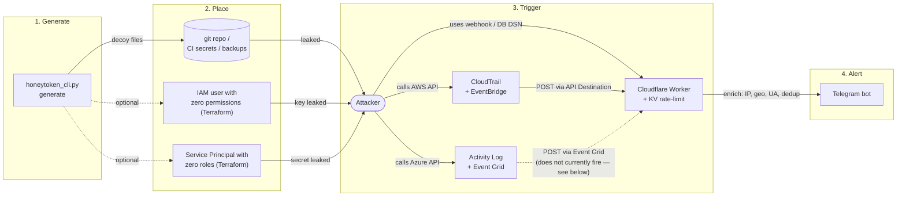
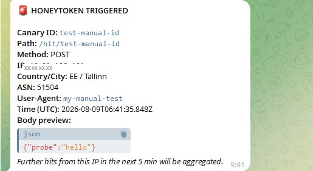
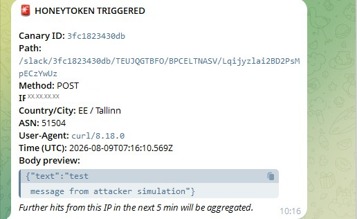
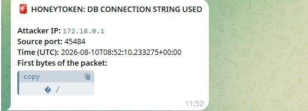
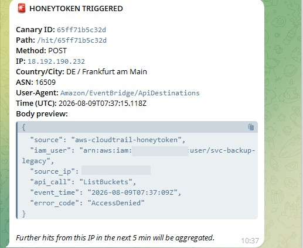
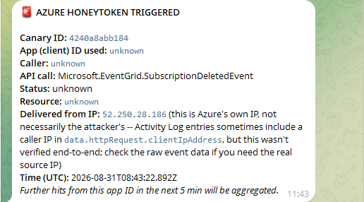

# Honeytoken Ecosystem

A small, self-hosted toolkit for generating and monitoring honeytokens: fake API keys, webhooks, and DB connection strings that you scatter around your repos, configs, and CI. Nobody legitimate ever touches these. If one gets used, you get a Telegram alert with the attacker's IP, geo, and user agent within seconds (or, for the AWS path, within a somewhat annoying number of minutes -- more on that below).

Zero infrastructure cost if you stay on free tiers: generation is a local Python CLI, the catcher runs on Cloudflare Workers (100k requests/day free), and the optional cloud integrations (AWS or Azure) are just an identity with zero permissions plus that cloud's native event pipeline -- no Lambda, no Azure Function, no server to babysit.

## Responsible use

This is a defensive tool: decoys you plant in infrastructure you own or are authorized to test, to catch unauthorized use of secrets. A few things worth being upfront about:

- Only deploy honeytokens in environments you own or have explicit authorization to instrument (your own repos, your own CI, your own cloud accounts). Don't scatter these in shared or third-party systems without permission.
- `tokens_vault.json` is your private map of what's fake and where it lives — it's auto-added to `.gitignore`, but double-check before every commit, especially if you're scripting this.
- The alert screenshots in this README have had the real IP addresses and AWS account ID redacted. If you fork this and post your own screenshots, check yours too — the alert bodies include your public IP and (for the AWS path) your account ID by design, since that's the whole point of the alert.
- The Azure module currently creates a real App Registration + Service Principal in your tenant even though detection doesn't work yet (see below) — that's still a live credential sitting in your directory, so the same "only in infrastructure you own" rule applies, and you may want to clean it up (`terraform destroy` in `azure/`) if you're not actively working on the detection gap.

## Prerequisites

Nothing here is expensive, but there's more setup than the Quickstart alone lets on, and none of it is optional the first time you read it -- so here's the honest list before you start.

**Accounts you'll need to create:**

| Account | Cost | What it's for |
|---|---|---|
| Cloudflare | Free, no card | Runs the Worker that catches HTTP-based triggers |
| Telegram | Free | Where alerts land -- create a bot via `@BotFather` |
| AWS | Free tier, **card required for verification** (won't be charged for the resources this project creates) | Only if you want the real AWS honeytoken -- skip if you're just doing webhook/DB decoys |
| Azure | Free tier, **card required for verification**, same deal as AWS | Only if you want to poke at the Azure honeytoken -- it currently doesn't detect anything (see the Azure section below), so there's little reason to set this up unless you're working on fixing it |
| A VPS provider (Hetzner, Vultr, etc.) | A few euros/month, or use hourly billing for a couple hours | Only if you want the DB honeytoken reachable from a real domain instead of localhost |

**Tools you'll need installed locally:**

- **Python 3.8+** and `pip` -- always required, this is what runs `honeytoken_cli.py`
- **Node.js + npm** -- required to install `wrangler` (Cloudflare's CLI), which you need for step 2 below no matter what
- **Docker** -- only if you're using the DB honeytoken
- **Terraform CLI + AWS CLI** -- only if you're using the AWS honeytoken
- **Terraform CLI + Azure CLI** -- only if you're using the Azure honeytoken

If you're on Windows, note that `wrangler` and WSL occasionally fight each other over binary architecture -- see the gotchas section near the bottom before you burn an hour on it.

**Two ways to go through this:**

- **Minimal path** -- Cloudflare + Telegram only, skip steps 5 and 6 below. Gets you working webhook and (localhost-only) DB honeytokens in about 10 minutes, no AWS account, no VPS, no Docker even.
- **Full path** -- everything, including a real internet-reachable DB honeytoken and a genuine AWS credential trap. Budget an evening, not because any single step is hard, but because the AWS piece involves waiting on CloudTrail delivery (see the AWS gotchas section) and because setting up your own domain for the DB listener takes a bit of DNS back-and-forth.

The Dockerfile in this repo packages **only the DB listener** (`fake_postgres_listener.py`). It doesn't containerize the Worker (that's not how Cloudflare Workers deploy -- `wrangler` pushes code to Cloudflare's own infrastructure, not to a container you run), the CLI, or the Terraform module. If you were hoping for one `docker run` that stands up the whole thing, that doesn't exist yet -- see Roadmap.

## Architecture



## Demo

A leaked webhook, DB connection string, or AWS key gets used → an alert lands in Telegram within seconds (AWS is the exception — see the CloudTrail gotchas below; Azure currently doesn't fire at all — see the Azure section below).

<table>
<tr>
<td></td>
<td></td>
</tr>
<tr>
<td align="center"><sub>Manual curl against the Worker</sub></td>
<td align="center"><sub>Decoy Slack webhook used by a simulated attacker</sub></td>
</tr>
<tr>
<td></td>
<td></td>
</tr>
<tr>
<td align="center"><sub>Postgres DSN connection attempt</sub></td>
<td align="center"><sub>AWS honeytoken key used, caught via CloudTrail → EventBridge</sub></td>
</tr>
</table>

## What's in here

| File / directory | What it does |
|---|---|
| `honeytoken_cli.py` | CLI: `generate` (create decoys), `clean` (wipe them), `ci-env` (dump values for CI secrets) |
| `cloudflare_worker.js` | Serverless catcher for HTTP-based triggers, with KV-backed dedup |
| `fake_postgres_listener.py` | TCP listener for the DB honeytoken (runs fine in Docker) |
| `Dockerfile`, `docker-compose.yml` | Packaging for the DB listener only -- doesn't cover the Worker, CLI, or Terraform |
| `terraform/` | AWS: IAM user with no permissions + CloudTrail + EventBridge -> Worker, no Lambda |
| `azure/` | Azure: App Registration + Service Principal with zero roles + Event Grid on Activity Log -> Worker. Deploys cleanly but the core detection does not currently work -- see the Azure section below for what was tested and why |
| `wrangler.toml` | Worker deploy config, including the KV namespace |

## Quickstart

### 1. Telegram bot

Talk to `@BotFather`, `/newbot`, grab the `TELEGRAM_BOT_TOKEN`. Send the bot any message, then hit `https://api.telegram.org/bot<TOKEN>/getUpdates` and pull `chat.id` out of the response.

### 2. Deploy the Cloudflare Worker

```bash
npm install -g wrangler
wrangler login

wrangler kv namespace create HONEYTOKEN_KV
# paste the returned id/preview_id into wrangler.toml

wrangler secret put TELEGRAM_BOT_TOKEN
wrangler secret put TELEGRAM_CHAT_ID
wrangler deploy
```

You'll get a `*.workers.dev` URL. If you want your own domain instead, see the wrangler.toml comments -- and read the gotcha about routes ordering further down, it'll save you twenty minutes.

### 3. Generate decoys

```bash
pip install -r requirements.txt

python3 honeytoken_cli.py generate \
  --output ./decoys \
  --canary-domain your-worker-domain.workers.dev
```

This writes `decoys/tokens_vault.json` (your private record of what's fake -- never commit it) plus the actual decoy files (`.aws_credentials`, `.env`, `config.json`), auto-added to `.gitignore`.

### 4. Scatter them

Old git branches, `.env.bak` files, an internal wiki page, public Docker image layers, a CI variable named something believable like `PROD_DB_BACKUP_URL`, a shared drive nobody's cleaned up since 2022. For CI secrets specifically:

```bash
python3 honeytoken_cli.py ci-env --format github-actions
```

### 5. (optional) DB honeytoken via Docker

```bash
cp .env.example .env   # fill in TELEGRAM_*
docker compose up -d
```

Two things that trip people up here:

- The filename has to change from `.env.example` to exactly `.env` -- Docker Compose only looks for `.env`, nothing else. The `cp` command above does this automatically, but if you're copying the file by hand in a file manager instead of the terminal, renaming it is a separate step you have to remember -- just dragging a copy over won't do it.
- `.env` won't show up in a plain `ls` afterwards -- files starting with a dot are hidden by default on Linux/macOS. That's normal, not a sign the copy failed. Use `ls -a` or `cat .env` to confirm it's there.

### 6. (optional) Real AWS honeytoken

```bash
cd terraform
terraform init
terraform apply \
  -var="worker_alert_url=https://your-worker-domain/hit/<canary_id>" \
  -var="aws_region=eu-central-1"
```

Creates an IAM user with zero permissions, a CloudTrail trail, and an EventBridge rule that POSTs straight to your Worker when the key gets used -- see the "AWS gotchas" section below before you run this, it'll save you a debugging afternoon.

### 6.5. (optional) Real Azure honeytoken

```bash
cd azure
terraform init
terraform apply \
  -var="worker_alert_url=https://your-worker-domain/azure-hit/<canary_id>"
```

Same idea as the AWS module -- an identity with zero permissions, wired to that cloud's native audit pipeline (Azure Activity Log, via Event Grid) which POSTs to the same Worker. **This module is currently confirmed broken -- read the Azure section below before running it.** Everything deploys cleanly and the webhook handshake works, but live testing showed Activity Log never records the honeytoken's calls, so no alert will fire on a real compromise. It's included because the infrastructure code is a reasonable starting point for fixing this, not because it works today.

### 7. Cleanup (e.g. before deploying to a real environment)

```bash
python3 honeytoken_cli.py clean --vault ./decoys/tokens_vault.json --yes
```

## Honest limitations

- **Slack/Discord webhooks and the DB connection string are the reliable triggers.** They're just a URL and a socket -- anything touching them gets caught, full stop.
- **A bare AWS key, Azure credential, or GitHub token doesn't call home by itself.** It's just a string. For AWS and Azure you need the respective Terraform module (see below). For GitHub there's no equivalent free path -- real audit-log monitoring on personal tokens is a GitHub Enterprise feature, not something you can bolt on for free.
- **Dedup window is 5 minutes** per (canary_id, IP) pair, with a digest every 50th repeat. Cuts down noise from scanners a lot, doesn't eliminate it -- a distributed botnet hitting from different IPs will still generate separate alerts, and that's fine, that's actually the interesting case.
- **This isn't a GitGuardian or Thinkst Canary replacement.** It's a lightweight thing for people who don't need (or can't justify) a whole platform for this one feature.

## AWS gotchas (learned by actually testing this, not by reading docs)

I built the first version of the Terraform module assuming CloudTrail's free 90-day event history would feed EventBridge automatically. It doesn't. Two things had to be fixed after a full end-to-end test kept coming up silent on real AWS calls even though a manually crafted `aws events put-events` fired instantly:

1. **You need an actual CloudTrail Trail.** Events sitting in the free Event History (what `aws cloudtrail lookup-events` shows you) are *not* forwarded to EventBridge. Only events captured by a configured Trail are. The module now creates a minimal Trail with its own S3 bucket for log storage.

2. **EventBridge drops read-only management events by default.** `GetCallerIdentity`, `ListBuckets`, any `DescribeXxx` call -- exactly the kind of recon an attacker does first -- gets silently filtered unless the rule's `state` is set to `ENABLED_WITH_ALL_CLOUDTRAIL_MANAGEMENT_EVENTS` instead of the default `ENABLED`. Both are wired into `terraform/main.tf` now.

Also worth knowing before you test:

- **Match your region.** `variables.tf` defaults `aws_region` to `us-east-1`. If your AWS CLI profile defaults to something else, the honeytoken IAM user and the EventBridge rule end up in different regions relative to where you're checking, and everything looks broken when it's actually just split across two places. Pass `-var="aws_region=..."` explicitly and match it to your CLI's default region.
- **Real CloudTrail delivery is slow.** Budget 15-25 minutes for the first real API call to show up as an alert -- CloudTrail -> S3 -> EventBridge has its own pipeline delay that has nothing to do with your setup. A manual `aws events put-events` test bypasses all of that and fires in seconds, which is a great way to confirm the Worker/Telegram side works, but it will NOT tell you whether the CloudTrail path is wired up correctly. Test both.
- **`GetCallerIdentity` requires zero IAM permissions to succeed**, even for a deny-all user -- it's a built-in AWS exception. If you're simulating an attacker probing the key, use something that actually returns `AccessDenied`, like `aws s3 ls`. Both get logged either way, but AccessDenied is a more honest simulation and shows up cleaner in the alert.

## Azure module -- currently broken, here's exactly how and why

Unlike the AWS module, **this one was tested end to end against a live tenant and the core detection path did not work.** Not "unverified" -- actually tried, actually failed, in a specific and now well-understood way. Read this before you spend time on it.

**What works fine:** `azure/main.tf` creates an App Registration + Service Principal with zero role assignments without issue -- the client_id + client_secret pair is the honeytoken, same idea as the AWS access key. The Event Grid System Topic and webhook subscription deploy cleanly, and the `/azure-hit/` validation handshake in the Worker works -- the subscription reaches `Succeeded` provisioning state.

**What doesn't work: Activity Log never records the honeytoken's failed calls, at all.** Three different live attempts, each waited out 15-40 minutes, each confirmed as a genuine `AuthorizationFailed` response directly from Azure's API (not a local CLI error):

1. A read call (`GET .../resourcegroups`) at the subscription level
2. A write call (`PUT .../resourcegroups/<name>`) at the subscription level
3. An action call (`POST .../storageAccounts/<name>/listKeys`) against a real, pre-existing Storage Account

All three produced a clean `AuthorizationFailed` from Azure. None of them showed up in `az monitor activity-log list`, and Event Grid's own `PublishSuccessCount` metric stayed at a confirmed `0.0` across every 5-minute bucket for the full test window -- meaning nothing was even offered to Event Grid, not "offered but filtered out." So the `advanced_filter` mentioned in earlier drafts of this section was never actually the bottleneck; the problem is upstream of it.

**Working theory (not confirmed by Microsoft docs, just the most coherent explanation that fits all three test results):** Activity Log's "Administrative" category appears to be populated by individual resource providers reporting their own operations -- including their own internal failures. A zero-permission identity gets rejected by Azure's RBAC/authorization layer *before* the request is ever handed off to a resource provider. If that's right, there's no resource-provider-level activity to log in the first place, because the resource provider never saw the request -- it was blocked at the front door. This would explain why even a call against a specific, real Storage Account (test 3) behaved identically to a generic subscription-level call (tests 1 and 2): all three were rejected at the same platform layer, before reaching any resource provider.

**What this means for using this module right now:** don't rely on it. A zero-permission Service Principal's stolen credentials, if used, will not currently generate a Telegram alert through this path, despite the whole pipeline (Activity Log -> Event Grid -> Worker -> Telegram) being correctly wired and the webhook handshake working. The failure mode here is quiet and total -- exactly the kind of thing this project's AWS section warns about, except this time the investigation ran out of leads rather than finding the fix.

**Why the obvious free workarounds don't exist, either -- three dead ends, each confirmed:**

- **Entra ID P1 free trial** -- blocked outright for the test account with a 401 pointing at insufficient Global Administrator rights. This can happen for reasons unrelated to the trial itself (e.g. an account's prior identity/billing history triggering Microsoft's abuse-prevention checks), so your mileage may vary, but it's not a given that "just start a free trial" works on the first try.
- **Reading Sign-in Logs directly via Microsoft Graph** (`GET /v1.0/auditLogs/signIns`), bypassing Diagnostic Settings entirely, with a dedicated App Registration granted `AuditLog.Read.All` application permission and admin consent -- returns a clean, unambiguous `403 Authentication_RequestFromNonPremiumTenantOrB2CTenant`. Confirmed with a real request, real permission, real consent. Microsoft enforces the P1/P2 requirement at the API layer itself, not just at the export/Diagnostic Settings layer -- there's no permission that unlocks this endpoint on a free tenant.
- **Microsoft 365 Developer Program instant sandbox** (which normally hands out a free E5 tenant, Entra ID P2 included) -- as of this testing, sign-up for personal accounts (Gmail/Outlook without an active Visual Studio Professional/Enterprise subscription or partner program membership) is closed. Not a bug, not a config issue -- Microsoft's own program status confirms free sandbox registration is currently paused for this account category.

Three independent paths, three independent confirmations, zero free options remaining. If you want Sign-in Logs, budget for an actual Entra ID P1 license (roughly $6-7/user/month at time of writing) -- there's no way around paying for it that was found here.

**Two directions worth trying if you want to pick this up:**

- **Give the honeytoken a real, narrow permission scoped only to a decoy resource group** (e.g. `Reader` on `honeytoken-canary-rg` and nothing else) so a call actually reaches a resource provider and succeeds, rather than being blocked at the RBAC layer. This changes the design from "zero permissions, catch the denial" to "trivial permissions on worthless resources, catch the use" -- a different but still valid honeytoken shape, and the only one of the two options that's actually free. Untested.
- **Entra ID Sign-in Logs**, which capture the authentication step itself rather than the API call, and expose the attacker's IP/geo directly in the log record (unlike Activity Log, which doesn't reliably include it). Requires a paid Entra ID P1 license, confirmed above -- no free path exists. If pursued, the architecture is: Sign-in Logs -> Diagnostic Settings -> Storage Account (cheaper) or Event Hub (faster, but Event Hub has no free tier and costs roughly $10+/month just sitting idle) -> a polling Logic App (Consumption tier) -> the same Worker, on a new `/azure-signin-hit/` path.

Until one of those is tried and confirmed working, treat the Azure honeytoken as **generated but not actually monitored** -- the credential looks real and gets scattered like any other decoy, but a real compromise of it will currently go undetected through this pipeline.

**The webhook validation handshake is handled correctly, for what it's worth.** Event Grid refuses to create a webhook subscription unless the endpoint responds correctly to a validation event first -- this isn't optional. The Worker's `/azure-hit/` path (separate from `/hit/`) handles this, and the subscription did reach `Succeeded` state during testing. If you're debugging this further, that part isn't where the problem is.

**One thing this whole investigation accidentally proved beyond doubt: the delivery pipeline itself is fully live.** While tearing down test infrastructure (deleting a Storage Account created for one of the earlier tests), Azure cascaded that into deleting its associated Event Grid subscription -- and Event Grid, as part of that teardown, fired a real `Microsoft.EventGrid.SubscriptionDeletedEvent` straight into the Worker's `/azure-hit/` endpoint. It showed up in Telegram seconds later, fully parsed, no errors. So however this Activity Log limitation eventually gets resolved, it won't be fighting the transport layer -- Event Grid -> Worker -> Telegram already works end to end, confirmed by an event Microsoft's own infrastructure generated, not a manual test. The missing piece really is scoped to "what triggers a real Activity Log event for a zero-permission identity," nothing downstream of that.

That discovery also surfaced a real false-positive source, now fixed: Event Grid's own lifecycle notifications (subscription created/updated/deleted, validation events, etc.) arrive on the same webhook and look just like real events on the wire -- the `SubscriptionDeletedEvent` above generated a bogus "AZURE HONEYTOKEN TRIGGERED" alert with every field showing `unknown`, because system events don't carry Activity Log fields like `claims`/`caller`/`resourceId`. The Worker now skips anything with an `eventType` starting with `Microsoft.EventGrid.` before it reaches the alerting logic -- if you're running an older copy of `cloudflare_worker.js`, deleting Azure test resources may generate a spurious Telegram alert until you update it.



<sub>The false positive this section describes -- every field `unknown` because it's Event Grid's own `SubscriptionDeletedEvent`, not a real Activity Log entry. This is what the bug looked like before the fix; you shouldn't see this with the current Worker code.</sub>

## Other things that bit me during testing (leaving these here so they don't bite you)

- **`wrangler.toml` and TOML table ordering.** If you add a `routes = [...]` block *after* a `[[kv_namespaces]]` section, TOML parses it as a property of that table, not a top-level key, and wrangler silently ignores it. Put `routes` before any `[[table]]` block, or just use a Custom Domain from the dashboard instead, which creates the DNS record for you and sidesteps the whole issue.
- **`wrangler` and WSL don't always get along.** If you've got Node/npm installed on the Windows side and you're calling `wrangler` from inside WSL, you can end up with a Windows-compiled `workerd` binary in a Linux environment, which crashes immediately. Simplest fix: install Node and wrangler natively inside WSL, or just run wrangler from PowerShell instead and leave AWS CLI/Terraform/Docker in WSL. Mixing shells across a project is mildly annoying but works fine.
- **`terraform apply` wants the literal word `yes`, not `y`.** Obvious in hindsight, easy to fumble if you paste a multi-line command and a stray `-var=` flag gets mangled -- Terraform will then interactively prompt for that variable's value instead of showing the plan, and typing "yes" into that prompt does not mean what you think it means. Run the command as one line if your terminal is doing anything weird with line wraps.
- **A missing or empty `.env` fails differently depending on how it's missing.** No `.env` file at all -- `docker compose up` refuses to start and tells you so, which is fine. But an `.env` that exists with blank `TELEGRAM_BOT_TOKEN`/`TELEGRAM_CHAT_ID` (easy to do if you copy `.env.example` and forget to fill it in) starts the container just fine and never sends a single alert, with no error anywhere. Both the DB listener and the Worker now log a loud warning on startup / on first alert attempt if these are missing -- check `docker compose logs` or `wrangler tail` if alerts aren't showing up and everything else looks right.

## Roadmap

- Fix Azure detection -- either scope the honeytoken a narrow real permission on a decoy resource group so calls reach a resource provider and get logged, or pay for Entra ID P1 and use Sign-in Logs (see the Azure section above for the full story on why the current zero-permission approach doesn't get logged by Activity Log, and why the free alternatives were dead ends)
- **Known issue, not urgent:** `honeytoken generate` regenerates *all* five decoy types every time it runs, including new random `canary_id`s for ones you might not have touched. If you've already deployed AWS (or Azure) infrastructure pointing at a specific `canary_id` and then re-run `generate` for an unrelated reason (e.g. to pick up a new decoy type after an update), the vault file drifts out of sync with what's actually deployed -- the deployed infrastructure keeps working, but the vault stops being a reliable source of truth for it. Worth adding a `--only` flag to regenerate a single token type without touching the rest.
- One-command setup that wraps the CLI, `wrangler deploy`, and Terraform behind a single script or container, so this doesn't require five separate tools installed locally -- the current setup assumes a comfort level with CLIs that not every small team has
- Harden `fake_postgres_listener.py` against real internet-facing scanning: move to async I/O instead of one thread per connection (matters if this ever sits on a public IP and gets hit by mass scanners like Shodan/Masscan), plus a Docker healthcheck and resource limits so a flood of connection attempts can't take down the host
- More decoy formats -- `.npmrc` / `.piprc` (fake private registry credentials), `kubeconfig` / `docker/config.json` (fake cluster and registry access), and DNS-based canaries (alert when an attacker resolves a hostname that shouldn't exist)
- Encrypt `tokens_vault.json` at rest instead of storing it as plaintext JSON
- IP geolocation via a proper API for more accurate alerts
- Scheduled token rotation
- Export alerts to a SIEM (Splunk/ELK) alongside Telegram

## Contributing

Issues and PRs welcome — especially around the GitHub-token detection gap and the Azure Activity Log problem (see Honest limitations and the Azure section above) if anyone finds a free-tier path that was missed here. For anything non-trivial, open an issue first so we're aligned before you put work into a PR.

## License

MIT — see [LICENSE](LICENSE). Use it, fork it, ship it in your own stack; just don't point it at infrastructure you don't own or have permission to test.
